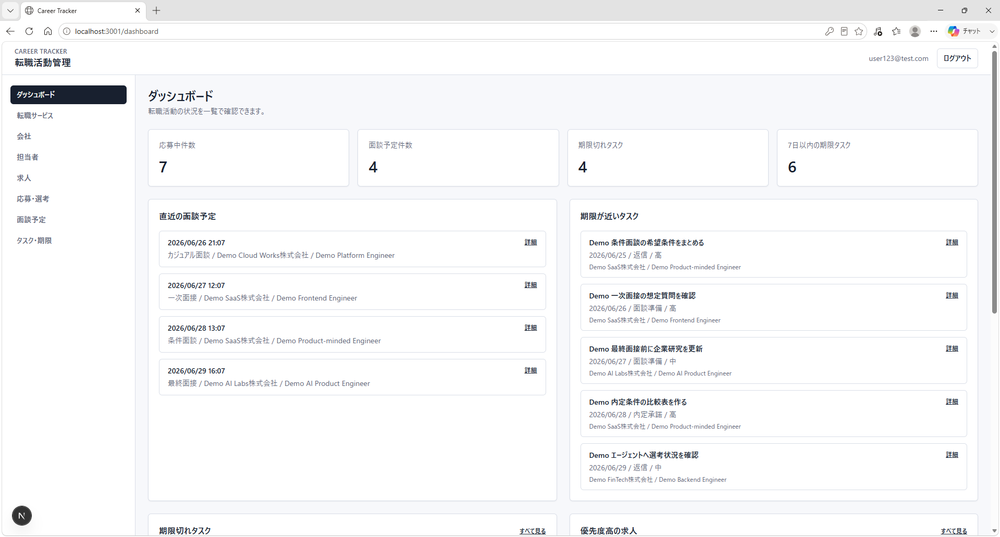
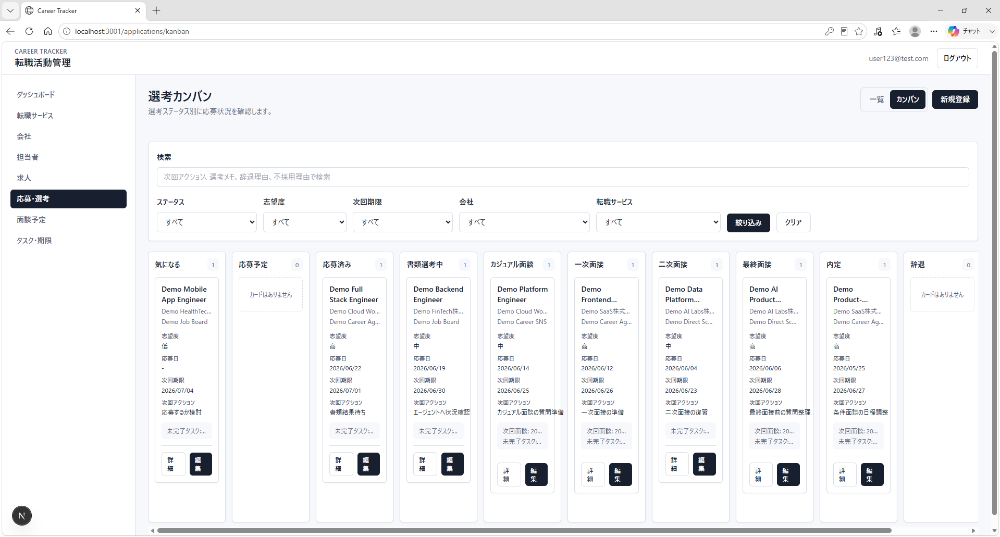
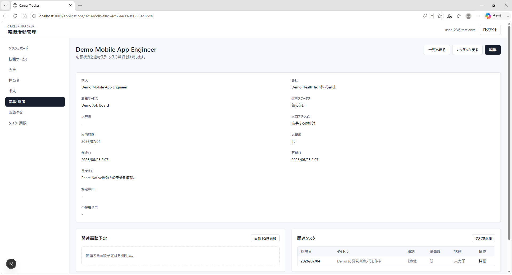
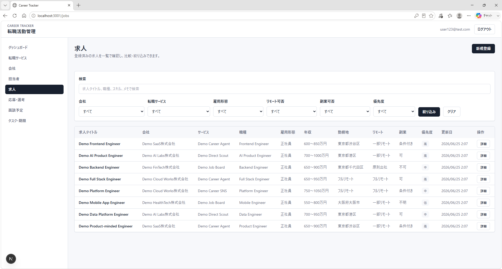
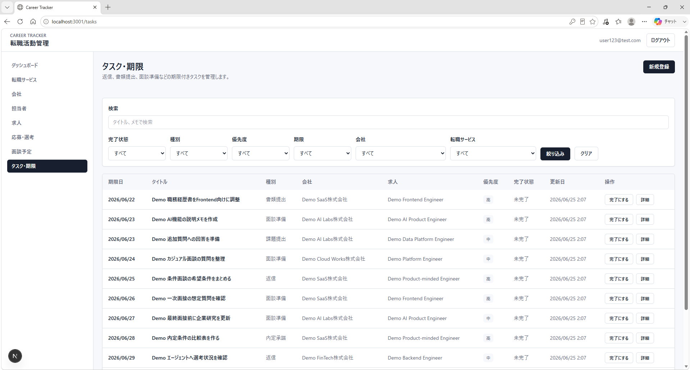

# Career Tracker

Career Tracker は、Next.js / TypeScript / Tailwind CSS / Supabase で実装した個人用の転職活動管理アプリです。

複数の転職サービス、会社、求人、応募・選考、面談予定、タスク・期限を一元管理するためのWebアプリです。  
個人利用を前提にしたMVPとして、転職活動の情報を「登録する」だけでなく、関連情報や期限を追いやすい状態にすることを重視しています。

## Screenshots

### Dashboard

応募状況、面談予定、期限切れタスク、優先度高の求人を一覧できます。



### Applications Kanban

応募・選考状況をステータス別に確認できます。



### Application Detail

応募・選考の詳細と、関連する面談予定・タスクを一画面で確認できます。



### Jobs List

求人を会社、サービス、勤務形態、優先度などで管理できます。



### Tasks List

期限付きタスクを一覧で確認し、完了状態を直接切り替えられます。



## Features

- Supabase Authによるログイン / ログアウト
- 未ログイン時の保護ページ制御
- 転職サービス、会社、担当者、求人のCRUD
- 応募・選考、面談予定、タスク・期限のCRUD
- 一覧検索 / フィルタ
- 削除確認
- 独自バリデーション表示
- バリデーションエラー時の入力値保持
- 求人、応募、面談、タスクの関連表示
- 応募・選考の一覧 / カンバン表示切り替え
- ダッシュボードの実データ集計
- 期限切れタスク、期限が近いタスク、優先度高の求人の表示
- ステータス別応募件数表示
- タスク完了状態の直接切り替え
- Supabase RLSによるユーザー別データ制御
- OpenAI APIによる求人票解析と登録前確認ポイント表示
- OpenAI APIによる応募・面接準備メモ生成
- OpenAI APIによる選考状況サマリー生成
- AI生成タスク案からのタスク作成
- AI選考状況サマリーからのタスク作成
- AI生成結果の選考メモへの追記
- AI生成履歴の保存と一覧表示
- OpenAI API未設定時のモック解析fallback

## Tech Stack

- Next.js
- React
- TypeScript
- Tailwind CSS
- Supabase Auth
- Supabase PostgreSQL
- Supabase Row Level Security
- Vercel

## App Structure

主な管理対象は以下です。

| Domain | 内容 |
| --- | --- |
| Services | 転職サイト、転職エージェント、スカウトサービス |
| Companies | 応募先企業 |
| Contacts | エージェント、企業人事、スカウト担当 |
| Jobs | 求人情報 |
| Applications | 応募・選考状況 |
| Interviews | 面談予定、面接予定 |
| Tasks | 返信、書類提出、面談準備などの期限付きタスク |

## Available Pages

- `/login`
- `/ai-history`
- `/dashboard`
- `/dashboard/ai-summary`
- `/services`
- `/services/new`
- `/services/[id]`
- `/services/[id]/edit`
- `/companies`
- `/companies/new`
- `/companies/[id]`
- `/companies/[id]/edit`
- `/contacts`
- `/contacts/new`
- `/contacts/[id]`
- `/contacts/[id]/edit`
- `/jobs`
- `/jobs/import`
- `/jobs/new`
- `/jobs/[id]`
- `/jobs/[id]/edit`
- `/applications`
- `/applications/new`
- `/applications/[id]`
- `/applications/[id]/ai-prep`
- `/applications/[id]/edit`
- `/applications/kanban`
- `/interviews`
- `/interviews/new`
- `/interviews/[id]`
- `/interviews/[id]/edit`
- `/tasks`
- `/tasks/new`
- `/tasks/[id]`
- `/tasks/[id]/edit`

## Setup

1. 依存関係をインストールします。

```bash
npm install
```

2. 環境変数ファイルを作成します。

```bash
cp .env.example .env.local
```

3. `.env.local` に Supabase の接続情報を設定します。

```env
NEXT_PUBLIC_SUPABASE_URL=
NEXT_PUBLIC_SUPABASE_ANON_KEY=
OPENAI_API_KEY=
OPENAI_MODEL=
```

4. Supabase SQL Editorでデータベーススキーマを実行します。

[supabase/schema.sql](./supabase/schema.sql) を使用します。

SQL Editorへ貼り付ける際は、SQL本文のみを実行してください。Markdownのコードフェンス（```sql など）は含めないでください。

5. AI機能を実APIで利用する場合は、`.env.local` にOpenAI APIキーを設定します。

```env
OPENAI_API_KEY=
OPENAI_MODEL=gpt-4o-mini
```

`OPENAI_API_KEY` が未設定の場合、AI機能はデモ用のモック結果を表示します。

6. Supabase Authenticationでログイン用ユーザーを作成します。

7. 開発サーバーを起動します。

```bash
npm run dev
```

8. ブラウザでアプリを開きます。

```text
http://localhost:3000/login
```

## Demo Data

ポートフォリオ用スクリーンショットは、デモデータを投入することで再現できます。

[docs/demo-data.md](./docs/demo-data.md) と [supabase/seed.sql](./supabase/seed.sql) を参照してください。

seed SQLは、指定したSupabase Authユーザーに対して、転職サービス、会社、担当者、求人、応募・選考、面談予定、タスクのデモデータを作成します。

## Deployment

Vercelへのデプロイ手順は [docs/deployment.md](./docs/deployment.md) にまとめています。

デプロイ前に以下を実行します。

```bash
npm run typecheck
npm run lint
npm run build
```

## Development Status

MVPは完成済みです。

| Phase | 内容 | 状態 |
| --- | --- | --- |
| Phase1 | 認証、Supabase接続、共通レイアウト | 完了 |
| Phase2 | 転職サービス、会社、担当者、求人の基本CRUD | 完了 |
| Phase3 | 応募・選考、面談予定、タスク・期限、カンバン | 完了 |
| Phase4 | ダッシュボード、期限注意、ステータス別件数、関連表示 | 完了 |
| Phase5 | ドキュメント整理、UX改善、ダッシュボード改善、リリース準備 | 完了 |
| Phase6 | ポートフォリオ化、デモデータ、スクリーンショット整備 | 完了 |
| Phase7 | AI機能 | 進行中 |

詳細な進捗は [docs/development_log.md](./docs/development_log.md) に記録しています。

## Roadmap

- CSV出力
- 通知機能
- Googleカレンダー連携
- PDF出力
- READMEへの追加スクリーンショット反映
- デモデータと公開用説明の継続改善

## Notes

- `.env.local` はGit管理しません。
- 転職サービス等のパスワードは保存しません。
- 主要テーブルは `user_id` を持ちます。
- Supabase RLSにより、ログインユーザー本人のデータのみ操作できる設計です。
- デモデータには架空の会社、担当者、応募情報のみを使用します。
